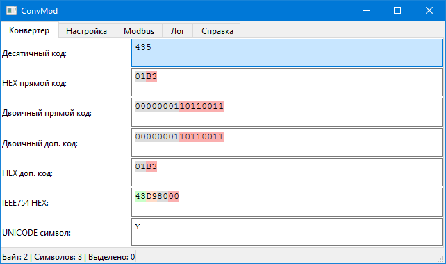
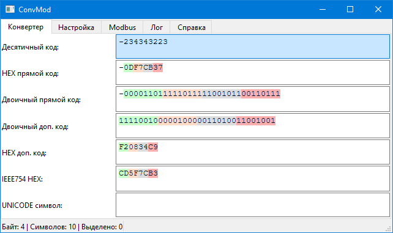
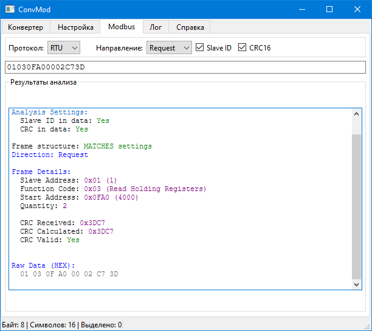

## ConvMod — Конвертер чисел и анализатор Modbus *

Приложение для конвертации чисел между различными форматами (десятичный, HEX, двоичный, IEEE754, Unicode, UTF-8) и анализа Modbus кадров (RTU, ASCII, TCP).**

## Возможности

### Конвертер чисел

- Десятичный код (целые и вещественные)
- HEX прямой и дополнительный код
- Двоичный прямой и дополнительный код
- IEEE754 (binary/hex) — 32-битный single precision
- Unicode и UTF-8 символы
- Подсветка байтов разными цветами

### Modbus анализатор

- Поддержка протоколов: RTU, ASCII, TCP **
- Определение направления: Request / Response
- Парсинг структуры кадра
- Проверка CRC16 (RTU) и LRC (ASCII) **
- Расшифровка кодов ошибок
- Логирование всех анализируемых команд

## Скриншоты

### Конвертер чисел



### Отрицательные числа



### Modbus анализатор



## Требования

- Python 3.11+
- PyQt6
- PyYAML

## Установка и запуск

```bash
git clone https://github.com/alexander13orlov/convmod.git
cd convmod
python -m venv venv
venv\Scripts\activate
pip install -r requirements.txt
python main.py
```

## Сборка EXE

**bash**

```
pyinstaller --onefile --windowed --name="ConvMod" --icon="favicon.ico" --add-data "widgets;widgets" --add-data "config_manager.py;." --add-data "converters.py;." --add-data "highlighters.py;." --add-data "validators.py;." --add-data "favicon.ico;." main.py
```

## Структура проекта

**text**

```
convmod/
├── main.py                 # Точка входа
├── config_manager.py       # Загрузка/сохранение настроек
├── converters.py           # Преобразование чисел
├── validators.py           # Валидация ввода
├── highlighters.py         # Подсветка байтов
├── widgets/                # GUI компоненты
│   ├── converter_widget.py
│   ├── modbus_widget.py
│   ├── main_window.py
│   └── modbus/             # Парсеры Modbus
│       ├── parser_tcp.py
│       ├── parser_rtu.py
│       ├── parser_ascii.py
│       └── parser_pdu.py
└── tests/                  # Юнит-тесты
```

## Тестирование

**bash**

```
python run_tests.py
```

## Лицензия

MIT

*Код написан с помощью deepseek
** Работа  анализатора ASCII не проверялась
